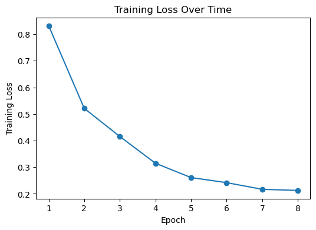

# X-Ray DL Project
# Author: Suhas Makineni

## Project Purpose

This project investigates the use of deep learning for chest X-ray analysis using a multitask learning approach. Traditional chest X-ray classification models focus only on disease prediction. In this project, the model simultaneously predicts disease labels and patient gender from chest X-ray images.

The motivation behind this approach is to explore whether learning multiple related tasks from the same image representation can improve overall feature learning and model performance.

The project was implemented in PyTorch using a pretrained ResNet18 architecture.

---

## Dataset

This project uses the NIH Chest X-ray Dataset:

https://www.kaggle.com/datasets/nih-chest-xrays/data

The full NIH dataset contains 112,120 chest X-ray images and associated metadata. Due to computational constraints, a subset of 4,999 images was used for model development and evaluation.

### Dataset Preparation

The NIH metadata file was filtered to include only images available in the local dataset folder. Disease labels from the NIH "Finding Labels" column were converted into a multi-label binary format containing 14 disease categories.

Metadata used in this project:

* Disease labels
* Patient gender
* Patient age
* View position

### Disease Categories

* Atelectasis
* Cardiomegaly
* Effusion
* Infiltration
* Mass
* Nodule
* Pneumonia
* Pneumothorax
* Consolidation
* Edema
* Emphysema
* Fibrosis
* Pleural Thickening
* Hernia

### Data Locations

Metadata:

```text
data/Data_Entry_2017.csv
```

Images:

```text
data/full_dataset/images/
```

---

## Model Architecture

The model uses a pretrained ResNet18 backbone as a shared feature extractor.

The extracted image features are passed to two separate prediction heads:

### Disease Classification Head

* Multi-label classification
* 14 disease outputs
* BCEWithLogitsLoss

### Gender Classification Head

* Binary classification
* Male/Female prediction
* CrossEntropyLoss

The final loss is computed as:

```text
Total Loss = Disease Loss + Gender Loss
```

---

## Training

### Training Configuration

* Backbone: Pretrained ResNet18
* Optimizer: Adam
* Learning Rate: 0.0001
* Batch Size: 32
* Epochs: 8
* Train/Validation Split: 80/20
* Hardware: NVIDIA GPU (CUDA)

### Training Script

```text
src/xray_project/train_model.py
```

### Train the Model

```bash
PYTHONPATH=src python src/xray_project/train_model.py \
  --csv_file data/Data_Entry_2017.csv \
  --image_dir data/full_dataset/images
```

---

## Results

## Training Loss Visualization



### Training Loss

| Epoch | Training Loss |
| ----- | ------------- |
| 1     | 0.8318        |
| 2     | 0.5210        |
| 3     | 0.4152        |
| 4     | 0.3147        |
| 5     | 0.2609        |
| 6     | 0.2418        |
| 7     | 0.2168        |
| 8     | 0.2126        |

Training loss decreased consistently throughout training, indicating that the model successfully learned useful image representations.

---

## Gender Classification Results

### Validation Metrics

| Metric    | Value |
| --------- | ----- |
| Accuracy  | 88.8% |
| Precision | 0.89  |
| Recall    | 0.89  |
| F1 Score  | 0.89  |

### Classification Report

| Class  | Precision | Recall | F1 Score |
| ------ | --------- | ------ | -------- |
| Female | 0.87      | 0.89   | 0.88     |
| Male   | 0.90      | 0.88   | 0.89     |

### Confusion Matrix

| Actual \ Predicted | Female | Male |
| ------------------ | ------ | ---- |
| Female             | 419    | 51   |
| Male               | 61     | 469  |

### Baseline Comparison

The dataset distribution was approximately:

* Male: 52.2%
* Female: 47.8%

A naive majority-class classifier would achieve approximately 52.2% accuracy. The multitask model achieved 88.8% validation accuracy, significantly outperforming this baseline.

---

## Disease Classification Results

Disease prediction was treated as a multi-label classification task.

The default threshold of 0.5 produced very few positive predictions, so threshold tuning was performed. The best results were obtained at a threshold of 0.15.

### Disease Metrics

| Metric    | Value |
| --------- | ----- |
| Precision | 0.206 |
| Recall    | 0.266 |
| F1 Score  | 0.232 |

Disease classification was considerably more challenging than gender prediction due to class imbalance and the multi-label nature of the problem.

---

## Evaluation

The evaluation notebook is located at:

```text
notebooks/evaluations.ipynb
```

The notebook demonstrates:

* Dataset exploration
* Sample chest X-ray images
* Disease frequency analysis
* Gender distribution analysis
* Model loading
* Prediction generation
* Gender classification evaluation
* Disease classification evaluation
* Training loss visualization
* Confusion matrix visualization

The evaluation metrics used in this project were:

* Validation Loss
* Accuracy
* Precision
* Recall
* F1 Score
* Confusion Matrix

---

## Example Prediction Visualization

Example chest X-ray images and corresponding labels are displayed in:

```text
notebooks/data_demo.ipynb
```

Additional evaluation examples and prediction results can be found in:

```text
notebooks/evaluations.ipynb
```

---

## Repository Structure

```text
X-ray-DL-project/
│
├── notebooks/
│   ├── data_demo.ipynb
│   └── evaluations.ipynb
│
├── src/xray_project/
│   ├── models.py
│   ├── train_model.py
│   └── dataset/
│       └── xray_dataset.py
│
├── outputs/
│   ├── xray_multitask_model.pt
│   ├── training_loss.png
│   └── train_metrics.txt
│
└── README.md
```

---

## Model Weights

Trained model weights are located at:

```text
outputs/xray_multitask_model.pt
```

If running on Talapas, the trained weights can also be found in the project's outputs directory.

---

## Limitations

Several limitations exist in the current implementation:

* Only a subset of the NIH dataset was used.
* Disease classification performance remains relatively low.
* Only gender metadata was included as an auxiliary task.
* The model was trained for a limited number of epochs.
* Additional metadata such as patient age and view position were not incorporated into the multitask framework.

---

## Future Work

Potential future improvements include:

* Training on the complete NIH dataset.
* Training for additional epochs.
* Using larger backbone architectures such as ResNet50 or EfficientNet.
* Adding age prediction and view-position prediction tasks.
* Comparing multitask learning against a disease-only baseline model.
* Computing additional disease metrics such as AUC-ROC.

---

## Conclusion

This project demonstrates a multitask learning framework for chest X-ray analysis using a pretrained ResNet18 backbone. The model successfully learned patient gender information, achieving 88.8% validation accuracy, while also learning disease-related features from the same images.

Disease prediction proved significantly more challenging due to class imbalance and the complexity of multi-label classification. Future work using larger datasets, additional metadata, and longer training times could further improve disease classification performance.
